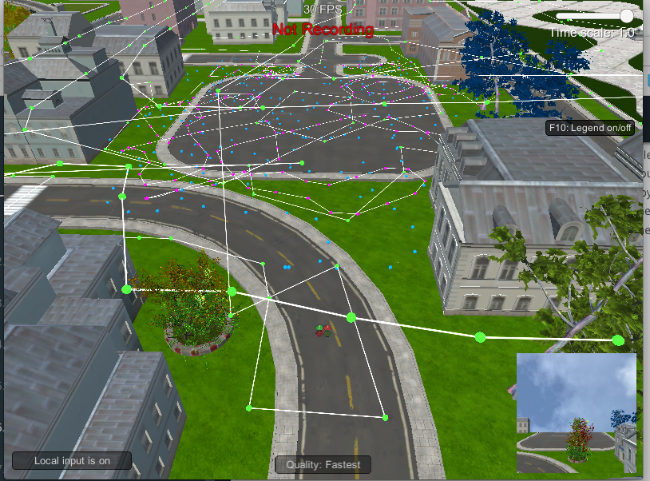

# RoboND-DeepLearning-Project

The objective of the "Follow Me" project was to create, and train, a fully convolutional network model, such that a target “Hero” person could be identified in simulated images of a city, via image segmentation, with an IOU of greater than 0.40.

The model and weights would then be fed to a simulated drone controller, to allow it to identify and follow the target.

The [writeup](writeup.pdf) outlines a successful implementation of the project (with discussion of additional topics required in the rubric). The [final Jupyter Notebook](code/model_training.ipynb), and resulting weights file, are also included.

